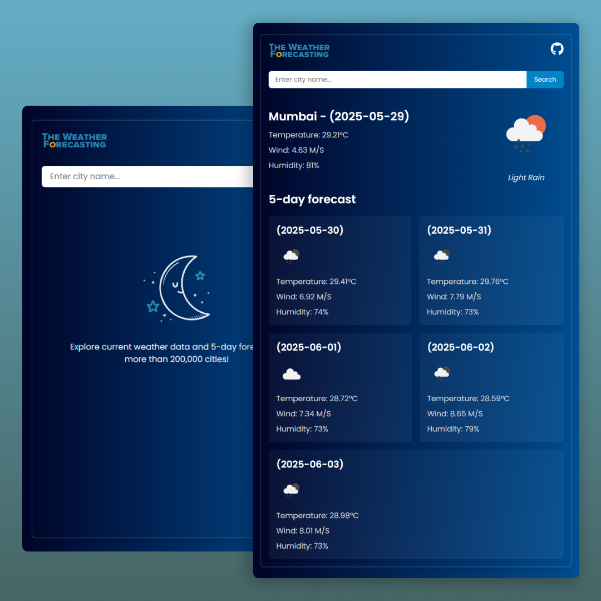

# Weather App

This is a weather forecast application built with **React**, **Context API**, and **OpenWeatherMap API**. It displays the current weather and 5-day forecast for a searched city with clean UI components.

## 🔧 Setup Instructions

### 1. Clone the repository

```bash
git clone https://github.com/your-username/Weathify.git
cd weathify
```

### 2. Install dependencies

```bash
npm install
```

### 3. Create a .env file in the root directory

```ini
VITE_API_KEY=your_openweathermap_api_key
```

### 4. Run the app

```bash
npm run dev
```

## 🌦️ Features

- Real-time current weather by city name
- 5-day forecast
- Loading and error handling
- Responsive and clean UI
- Stores last searched city in localStorage

## 📦 Tech Stack

- React
- Context API
- Axios
- OpenWeatherMap API
- CSS (vanilla)

## 💡 Approach

- Used React Context API for global state and weather management
- Built reusable components for cleaner structure
- Added localStorage support to persist last searched city
- Handled errors gracefully and provided user feedback with loaders and messages

## ✨ UI Preview


